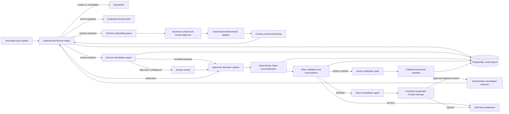

# AnalystOps Engineering Evidence Record

Evidence date: 2026-09-26

This record summarizes what the repository has demonstrated through retained
artifacts and executable tests. It separates deterministic validation, live
model evaluation, and an external-workbook production exercise so that each
claim remains traceable and defensible.

## Executive Evidence

| Area | Demonstrated result | Evidence |
| --- | --- | --- |
| Bronze corpus | 6,534 of 6,534 generated workbooks matched expected lifecycle handling | [Bronze validator](../src/analystops/ingestion/validate.py), [materializer](../src/analystops/ingestion/materialize.py) |
| Bronze routing | 2,376 accepted, 2,970 awaiting review, 594 quarantined, 594 duplicates | `data/ingestion/corpus-results/` |
| Silver corpus | 594 clean workbooks and 1,044,848 rows published; 454 PASS and 140 WARN | [Silver summary](../data/validation/silver/summary.json) |
| Agent evaluation | 200 of 200 cases succeeded across five scenarios; 100% finding accuracy; zero false automatic approvals | [Production gate](../data/agents/evaluations/20260925T150719Z_9b11d08f-ca89-4232-853e-d4b2d3aa4f28.json) |
| Agent efficiency | 766.045 tokens per case; 2.110 s p50 and 3.223 s p95 latency; 1.5% retry and 0.5% escalation rates | [Production gate](../data/agents/evaluations/20260925T150719Z_9b11d08f-ca89-4232-853e-d4b2d3aa4f28.json) |
| External workbook | 10,194 source rows partitioned into 85 country-month submissions; 10,193 rows published after one approved duplicate removal | [Onboarding audit](../data/workflows/schema-onboarding/7a71b1a6-8474-4b66-a98a-982723e5107a/workflow.json) |
| Human control | Agent deferred an ambiguous duplicate; a human approved a hash-bound Silver operation | [Agent proposal](../data/workflows/bronze-to-silver/ad2b9157-3ca3-4916-95a0-1bcd7619b66d/agent-proposal.json), [approved workflow](../data/workflows/bronze-to-silver/8575678a-b4d1-42b0-959a-9f9eeaac30ea/workflow.json) |
| Production batch | 85 of 85 workflows completed as Silver publishable with zero failures | [PostgreSQL-backed batch](../data/workflows/batches/a3acf338-e8ae-4c99-bd9b-08c80b574275/batch.json) |
| Silver publication | Atomic gate published 85 canonical workbooks and 10,193 rows; PostgreSQL retained one publication run and 85 lineage items | [Publication receipt](../data/silver/remediation/ffff29a9-48cc-4b82-802d-ac5f4d974712/publication.json), [database verification](../data/publication/silver/postgres-verification.json) |
| Tenant isolation | Correct tenant saw 85 workbooks, Bronze runs, workflows, Silver runs, and batch items; another tenant saw zero | [PostgreSQL verification](../data/workflows/batches/a3acf338-e8ae-4c99-bd9b-08c80b574275/postgres-verification.json) |
| Automated tests | 96 tests passed with PostgreSQL enabled; zero failures, errors, or skips | [Test suite](../tests) |

## Architecture



PostgreSQL stores operational metadata, evidence, decisions, and lineage. Raw
workbooks and canonical JSONL remain external artifacts referenced by URI. It is
therefore a tenant-aware control plane, not a replacement for object storage or
a future analytical warehouse.

## Safety Model

The system is deterministic first. Models cannot directly edit workbooks,
approve human-only operations, or publish Silver data.

The trust boundaries are:

1. Bronze treats every workbook cell as untrusted data and performs package,
   active-content, formula, schema, duplicate, and volume checks.
2. Agents receive compact evidence rather than unrestricted workbook content.
3. Model output must match a strict structured schema and an approved operation
   registry.
4. High-risk or business-dependent operations require a hash-bound human
   resolution.
5. Silver executes only the authorized deterministic plan and reconciles input,
   accepted, rejected, and dropped rows before publication.
6. PostgreSQL row-level security scopes operational records by `client_id`.

Primary implementation:

- [Bronze validation](../src/analystops/ingestion/validate.py)
- [Human review](../src/analystops/ingestion/review.py)
- [Bronze remediation agent](../src/analystops/agents/bronze_remediation.py)
- [Schema onboarding agent](../src/analystops/agents/schema_onboarding.py)
- [Operation registry](../src/analystops/transformations/operations.py)
- [Silver canonicalization](../src/analystops/transformations/silver.py)
- [Silver validation](../src/analystops/validation/silver.py)
- [Silver remediation agent](../src/analystops/agents/silver_remediation.py)
- [Persisted remediation graph](../src/analystops/workflows/silver_remediation_graph.py)
- [Silver publication gate](../src/analystops/workflows/silver_publication.py)
- [Batch orchestration](../src/analystops/workflows/batch_bronze_to_silver.py)
- [PostgreSQL persistence](../src/analystops/persistence/postgres.py)

## Deterministic Corpus

The generated corpus contains 594 clean country-month workbooks and ten
corruption variants per clean workbook, for 6,534 manifests and workbooks.
Reconciliation of retained manifests against persisted Bronze records produced:

| Lifecycle | Workbooks | Meaning |
| --- | ---: | --- |
| `BRONZE_ACCEPTED` | 2,376 | Authorized to proceed to Silver |
| `AWAITING_REVIEW` | 2,970 | Human or agent-assisted resolution required |
| `QUARANTINED` | 594 | Unsafe, unreadable, or structurally unusable |
| `DUPLICATE` | 594 | Previously observed file or normalized content |
| **Total** | **6,534** | **6,534 expected outcomes matched; 0 mismatches** |

The 3,564 workbooks outside the review queue must not be described as all
approved: only 2,376 were authorized for Silver; quarantine and duplicate are
terminal non-review routes.

The historical Silver corpus validation used `silver-validation-v2` and
published all 594 clean candidates, totaling 1,044,848 canonical rows. The
external-workbook exercise below uses the later `silver-validation-v3`, which
tightened cancellation semantics.

## Agent Production Gate

The retained production evaluation selected 200 cases with seed 42, evenly
distributed across currency strings, date changes, duplicate rows, incomplete
files, and renamed columns. Answer keys were loaded only after each model call.

| Metric | Result |
| --- | ---: |
| Successful cases | 200 / 200 |
| Correct findings | 207 / 207 |
| Finding accuracy | 100% |
| False automatic approvals | 0 |
| Expected and actual automatic findings | 123 / 123 |
| Expected and actual human-routed findings | 84 / 84 |
| Retried cases | 3 |
| Failed attempts | 4 |
| Escalated cases | 1 |
| Total tokens | 153,209 |
| Tokens per case | 766.045 |
| Latency p50 | 2,110.064 ms |
| Latency p95 | 3,223.090 ms |

The bounded routing policy used `gpt-5.6-luna` as the primary model and
`gpt-5.6-terra` only for escalation, with a 500-token output ceiling. Compared
with the retained baseline, tokens per case fell from 813.92 to 766.045, retry
rate fell from 6% to 1.5%, and escalation rate fell from 2% to 0.5%, without a
quality regression.

These are evaluation results on seeded scenarios, not a claim of perfect model
accuracy on arbitrary production data.

## External Workbook Exercise

An unseen Sample Superstore workbook tested behavior outside the UCI training
shape. Initial Bronze correctly rejected the schema. The onboarding agent used
business context to propose five mappings and one derived `Price = Sales /
Quantity` field. The proposal consumed 1,640 tokens and 5.938 seconds, then
required explicit human approval before execution.

The approved contract:

- Bound the source file, proposal, business context, selected sheet, mappings,
  ignored sheets, and derivation to hashes.
- Blocked division by zero instead of inventing values.
- Preserved the original workbook unchanged.
- Produced 85 immutable country-month submissions from 10,194 source rows.
- Attached contract, client, and source lineage to every Bronze and Silver run.

One two-row Canada partition contained one exact duplicate, producing a 50%
duplicate rate. The remediation agent consumed 762 tokens in 3.607 seconds and
deferred with `BUSINESS_KNOWLEDGE_REQUIRED`. After a human verified the rows and
approved `deduplicate_in_silver`, Silver accepted one row, dropped one row,
rejected none, and reconciled net revenue to 99.12.

The final retained batch made 10,193 rows across all 85 partitions eligible for
publication:

- 84 `PUBLISHABLE`
- 1 `PUBLISHABLE_WITH_WARNINGS`
- 0 failures
- 0 model calls in the final batch because all ambiguity had already been
  resolved and persisted

This exercise also exposed and corrected source coupling: a previous UCI rule
treated every invoice beginning with `C` as cancelled, which misclassified
positive Superstore `CA-*` orders. `silver-validation-v3` now requires both a
`C` prefix and negative quantity and records that policy in each profile.

## Completed Silver Publication Milestone

The Silver remediation agent diagnosed the cross-partition duplicate profile
and produced a constrained proposal. LangGraph persisted two human boundaries:
approval of deterministic repartitioning and the later duplicate disposition.
The approved executor reran Bronze and Silver, reconciled 10,194 input rows to
10,193 accepted rows and one dropped duplicate, and stopped at
`READY_FOR_PUBLICATION`.

The separate `silver-publication-v1` gate then rehashed every canonical file and
validation profile, rechecked row reconciliation, and atomically merged 85
entries into the authoritative manifest. The manifest now contains 679
workbooks and 1,055,041 rows: the 594-workbook historical corpus plus this
85-workbook external publication. Its immutable receipt records:

| Publication field | Result |
| --- | ---: |
| Status | `PUBLISHED` |
| Publication/execution ID | `ffff29a9-48cc-4b82-802d-ac5f4d974712` |
| Published workbooks | 85 |
| Published rows | 10,193 |
| Approved dropped rows | 1 |
| PostgreSQL publication runs | 1 |
| PostgreSQL publication items | 85 |

Replaying the gate is idempotent: the existing receipt prevents republishing
files while allowing PostgreSQL persistence to be retried independently.

## Failure Durability

A deliberately network-restricted agent run exhausted three bounded attempts
and wrote a durable `AGENT_RETRY_EXHAUSTED` workflow audit marked retryable.
After network access was restored, the same workbook reached the human boundary
without losing its Bronze identity. The 200-case gate independently recorded
four failed attempts, three retried cases, and one model escalation while still
completing all cases.

Evidence:

- [Retryable failure audit](../data/workflows/bronze-to-silver/a9505e5f-e8ab-454e-bbcf-4f47196c0e84/workflow.json)
- [Successful deferred proposal](../data/workflows/bronze-to-silver/ad2b9157-3ca3-4916-95a0-1bcd7619b66d/agent-proposal.json)
- [Human-approved rerun](../data/workflows/bronze-to-silver/8575678a-b4d1-42b0-959a-9f9eeaac30ea/workflow.json)

## PostgreSQL Evidence

The final batch used tenant UUID
`a599f9da-35b3-5ada-89c4-67ff449294d6` for `Tableau Superstore Demo`.
Application-role queries under that tenant returned:

| Table | Visible rows |
| --- | ---: |
| Clients | 1 |
| Workbooks | 85 |
| Bronze runs | 85 |
| Workflow runs | 85 |
| Silver runs | 85 |
| Batch runs | 1 |
| Batch items | 85 |
| Publication runs | 1 |
| Publication items | 85 |

The same queries under a different tenant returned zero rows from every table.
All 85 batch items reported `persisted: true`. This demonstrates row-level
tenant isolation for the retained run; it is not a throughput benchmark for a
large multi-tenant deployment.

## Verification

The full suite ran against local PostgreSQL:

```bash
TEST_DATABASE_URL=postgresql://... \
PYTHONPATH=src .venv/bin/python -m unittest discover -s tests
```

Result on 2026-09-26: 96 tests run in 1.411 seconds; 96 passed, 0 failed,
0 errored, and 0 skipped.

Coverage includes deterministic intake, review authorization, transformation
plans, Silver canonicalization and validation, both remediation agents,
schema onboarding, LangGraph interruption and resume behavior, publication
integrity and idempotency, failure durability, batch resume behavior,
PostgreSQL persistence, and tenant isolation.

## Resume-Ready Claims

Use measured, scoped wording:

- Built a deterministic-first agentic data pipeline that validated 6,534 Excel
  workbooks across clean and corrupted scenarios with 100% lifecycle agreement
  against generated answer keys.
- Designed constrained LLM remediation with structured outputs, operation
  allowlists, model escalation, token and latency telemetry, and human approval
  for high-risk actions; achieved 100% finding accuracy and zero false automatic
  approvals on a 200-case production gate.
- Implemented hash-bound schema onboarding for unseen workbooks, converting a
  10,194-row external dataset into 85 country-month Silver publications while
  preserving source, contract, workbook, and row lineage.
- Built a resumable four-worker batch control plane backed by PostgreSQL row-level
  security; retained 85 successful tenant-scoped workflows, one atomic
  publication run, and 85 publication lineage items.
- Implemented a persisted LangGraph Silver-remediation workflow with bounded
  model proposals, two human approval interrupts, deterministic execution,
  resumability, and an idempotent publication gate.

Avoid claiming:

- Millions of production workbooks or real customer traffic.
- A production-deployed LangGraph service; the retained workflow runs locally
  and uses a SQLite checkpointer.
- Perfect model accuracy outside the measured five-scenario evaluation.
- PostgreSQL as the analytical warehouse; it currently serves as the metadata
  and operational control plane.

## Interview Defense

**Why use an agent at all?**

Known validations and transformations remain deterministic. The model is used
only where evidence requires semantic interpretation, such as proposing a
column mapping or explaining why a business-dependent duplicate must be
deferred.

**How is unsafe automation prevented?**

The model returns a typed proposal, not executable code. The proposal is checked
against active Bronze findings and an operation registry. High-risk operations
require a workbook-hash-bound human resolution, and Silver reruns deterministic
validation before publication.

**How are token costs controlled?**

Only compact findings and schema evidence are sent to the model. Output is
schema-constrained and capped. A smaller primary model handles normal cases and
a stronger model is called only after bounded failure or escalation. The
production gate measured 766.045 tokens per case and a 0.5% escalation rate.

**Why PostgreSQL?**

The workload needs relational identity, referential integrity, idempotent
upserts, transaction boundaries, audit queries, and row-level tenant security.
Large workbook and canonical payloads remain external artifacts, avoiding use
of PostgreSQL as blob storage.

**Why introduce LangGraph for Silver remediation?**

Silver remediation introduced durable human interrupts, a second decision after
repartitioning exposed a local duplicate, and retry without replaying model or
approval steps. LangGraph now coordinates those state transitions; validation,
transformation, and publication remain deterministic Python boundaries.

## Known Limits And Next Phase

- The 200-case gate covers five seeded Bronze ambiguity scenarios.
- The external production exercise contains one public workbook and one demo
  tenant.
- Dollar cost is not claimed because the retained evidence records tokens, not
  a reconciled provider invoice and time-stable pricing snapshot.
- LangGraph checkpointing is local SQLite rather than tenant-scoped PostgreSQL.
- Human review is exposed through the CLI, not an authenticated review API.
- No Gold analytical model or production object-store integration exists yet.

The next justified implementation is production hardening: tenant-scoped
PostgreSQL checkpointing and an authenticated review boundary. Gold analytical
models can follow once the operational workflow is closed cleanly.

## Evidence Index

- [Bronze production evaluation](../data/agents/evaluations/20260925T150719Z_9b11d08f-ca89-4232-853e-d4b2d3aa4f28.json)
- [Schema onboarding proposal](../data/agents/schema-onboarding/Sample-Superstore_9ceda516512c_1bbbb156-d5f2-452a-8ee6-2dcaf88576e2.onboarding.json)
- [Approved schema contract](../data/onboarding/contracts/tableau-superstore_faa2881d-e598-40eb-bb0e-ba23ff6e55e4.contract.json)
- [Schema onboarding workflow](../data/workflows/schema-onboarding/7a71b1a6-8474-4b66-a98a-982723e5107a/workflow.json)
- [Agent human-review decision](../data/workflows/bronze-to-silver/ad2b9157-3ca3-4916-95a0-1bcd7619b66d/agent-proposal.json)
- [Approved transformation plan](../data/workflows/bronze-to-silver/8575678a-b4d1-42b0-959a-9f9eeaac30ea/transformation-plan.json)
- [Final Silver profile](../data/validation/silver/profiles/8dfb4982ad01afb14f1f2f2dd42260faae3a0bc1ce2cc8b9988eb91327a19b64.json)
- [PostgreSQL-backed batch](../data/workflows/batches/a3acf338-e8ae-4c99-bd9b-08c80b574275/batch.json)
- [PostgreSQL verification](../data/workflows/batches/a3acf338-e8ae-4c99-bd9b-08c80b574275/postgres-verification.json)
- [Silver remediation proposal](../data/agents/silver-proposals/f3b48f030427f6c6324744f86a25a0292b8965dac3a790c3138cf3ea6e44de51.silver-agent.json)
- [LangGraph remediation audit](../data/workflows/silver-remediation/e5915bbc-352d-4233-923f-9486cb4697f9/workflow.json)
- [Silver remediation execution](../data/silver/remediation/ffff29a9-48cc-4b82-802d-ac5f4d974712/execution.json)
- [Silver publication receipt](../data/silver/remediation/ffff29a9-48cc-4b82-802d-ac5f4d974712/publication.json)
- [Authoritative Silver manifest](../data/publication/silver/manifest.json)
- [Publication PostgreSQL verification](../data/publication/silver/postgres-verification.json)
